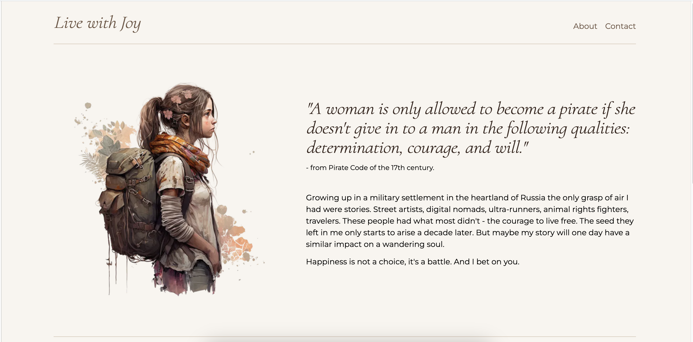
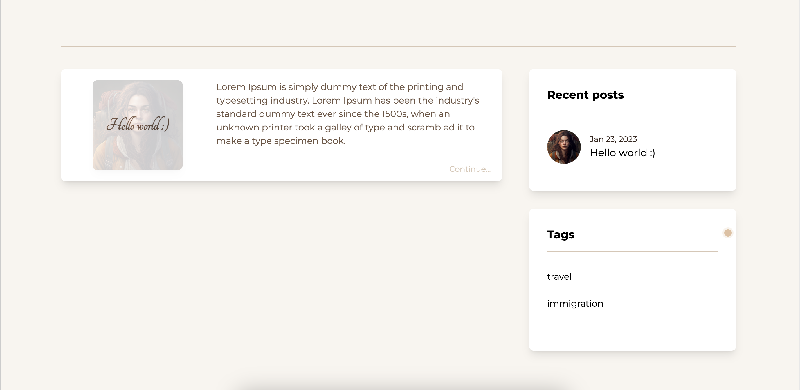
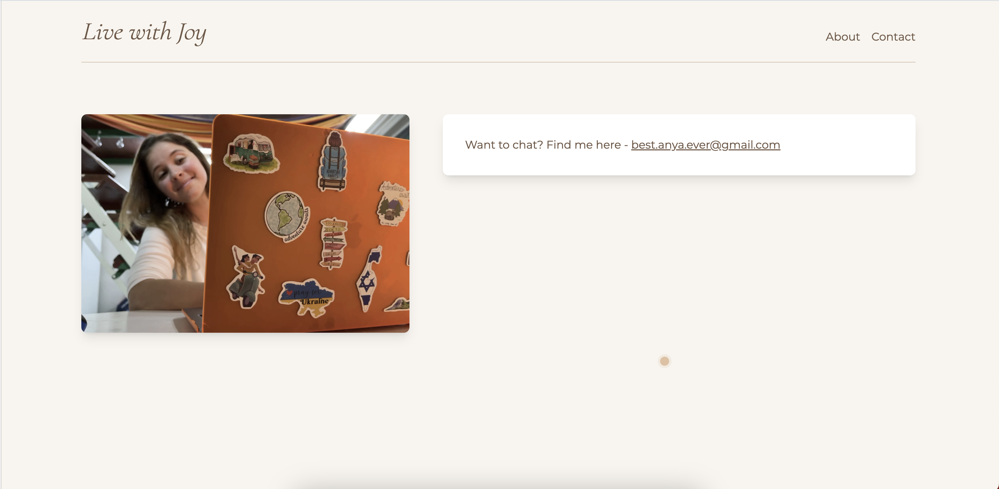

https://personal-blog-three-rouge.vercel.app

# Blog - Live with Joy

Live with Joy is a web application created for posting articles, collecting comments and filtering posts. 

The application was created with an agenda to have an independent platform for personal blogging.

## Table of contents

- [Overview](#overview)
  - [The challenge](#the-challenge)
  - [Screenshot](#screenshot)
- [My process](#my-process)
  - [Built with](#built-with)
  - [What I learned](#what-i-learned)
  - [Continued development](#continued-development)
- [Author](#author)
- [Acknowledgments](#acknowledgments)

## Overview

### The challenge

Users should be able to:

- View the optimal layout depending on their device's screen size (desktop only)
- View a feed of posts in random order
- Filter posts by tags
- View most recent posts from Home page
- View related posts from post pafe
- View preview of posts on Home page
- View and comment full posts on it's route
- View About and Contact pages

### Screenshot

## Our process

### Built with

- CSS/HTML/JavaScript
- NextJs
- Tailwind
- GraphCMS

### What I learned

- NextJs
- Tailwind
- GraphCMS

### Continued development

In the future we would like to add features as:

- Loader
- Views count
- Maps for travel posts
- Mobile layout
- Auto-filled name for comments (local storage)

## Author

Anya Joy - @AnyaJoy

## Acknowledgments

This application was created with help of JavaScript Mastery youtube tutorial. And my love-hate relationship with Instagram :)
